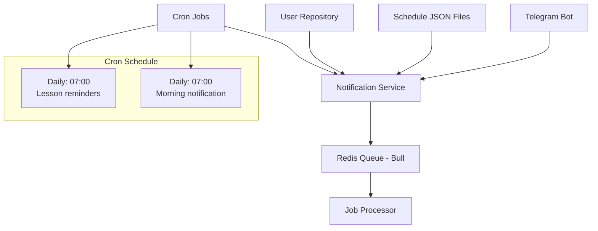

# 🏛️ KazNU Lighthouse

> Telegram бот для автоматических уведомлений о расписании занятий Казахского национального университета

[](https://nodejs.org/)
[](https://www.typescriptlang.org/)
[](https://redis.io/)
[](https://core.telegram.org/bots/api)

## ✨ Основные возможности

Расписание для двух учебных групп с возможностью переключения между ними посредством команды `/change`

## 🚀 Быстрый старт

### Предварительные требования

- **Node.js** 18 или выше
- **Redis** сервер
- **Telegram Bot Token** (получить у [@BotFather](https://t.me/BotFather))

### 1. Клонирование и установка

```bash
git clone https://github.com/your-username/kaznu-lighthouse.git
cd kaznu-lighthouse
pnpm install
```

### 2. Настройка окружения

```bash
cp env.example .env
```

Отредактируйте `.env` файл:

```env
# Telegram Bot Token (обязательно)
BOT_TOKEN=your_telegram_bot_token_here

# Redis Configuration
REDIS_HOST=localhost
REDIS_PORT=6379
REDIS_PASSWORD=your_redis_password_here
REDIS_DB=0
```

### 3. Запуск Redis

#### Локальная установка

```bash
# macOS
brew install redis
redis-server

# Ubuntu/Debian
sudo apt-get install redis-server
sudo systemctl start redis-server
```

### 4. Запуск бота

```bash
# Сборка и запуск
pnpm build
pnpm start

# Или полный запуск с Redis
pnpm start:full
```

## 📋 Доступные команды

| Команда   | Описание                    |
| --------- | --------------------------- |
| `/change` | Переключение между группами |

## 🏗️ Архитектура системы



### Компоненты

#### 🔄 Notification Service

- Управление пользователями и подписками
- Форматирование сообщений с расписанием
- Интеграция с Redis Queue для асинхронной обработки
- Мониторинг состояния системы

#### 📊 Redis Queue (Bull)

- **Асинхронная обработка**: Неблокирующая отправка уведомлений
- **Планирование**: Отложенные задачи для напоминаний
- **Надежность**: Сохранение состояния при перезапуске
- **Мониторинг**: Через Redis CLI

#### ⏰ Cron Jobs

- **Ежедневное уведомление**: 07:00 (Asia/Almaty) с количеством занятий
- **Напоминания о занятиях**: Каждый день в 07:00 планируется cron расписание на весь день
- **Автоматическое планирование**: Создание задач за час до занятия, за 10 минут до следующего урока

## 📅 Формат расписания

Проект поддерживает две группы расписания в файлах `src/public/schedule_1.json` и `src/public/schedule_2.json`. Каждый файл содержит расписание в следующем формате:

```json
{
  "saturday": [
    {
      "start_time": "09:00",
      "course": "Формальные методы и приложения",
      "room": "422 (ФИТ)"
    },
    {
      "start_time": "10:00",
      "course": "Алгоритмы",
      "room": "402 (ФИТ)"
    }
  ]
}
```

### Правила именования дней недели

Используйте английские названия в нижнем регистре: `monday`, `tuesday`, `wednesday`, `thursday`, `friday`, `saturday`, `sunday`

## 💬 Примеры сообщений

### Утреннее уведомление

```
Доброе утро. Сегодня 15 декабря и у нас 4 занятия
```

### Напоминание о занятии

```
Урок Алгоритмы начнется через час и пройдет в 402 (ФИТ)
```

## 🛠️ Разработка

### Полезные команды

```bash
# Разработка с автоперезагрузкой
pnpm dev

# Управление Redis
pnpm redis          # Запуск Redis
pnpm redis:local    # Локальный запуск Redis

# Управление пользователями
pnpm check:users    # Проверка пользователей
pnpm manage:users   # Управление пользователями

# Redis CLI
pnpm redis:cli      # Подключение к Redis
```

### Структура проекта

```
kaznu-lighthouse/
├── src/
│   ├── bot.ts                    # Основной файл бота
│   ├── config/
│   │   └── redisConfig.ts        # Конфигурация Redis
│   ├── services/
│   │   ├── notificationService.ts # Сервис уведомлений
│   │   └── user-repository.ts     # Репозиторий пользователей
│   ├── public/
│   │   ├── schedule_1.json        # Расписание группы 1
│   │   └── schedule_2.json        # Расписание группы 2
│   └── types.ts                   # TypeScript типы
├── scripts/
│   ├── check-users.js             # Проверка пользователей
│   ├── manage-users.js            # Управление пользователями
│   └── start-redis.sh             # Скрипт запуска Redis
├── redis.conf                     # Конфигурация Redis
└── env.example                    # Пример переменных окружения
```

## 🔧 Конфигурация

### Redis настройки

Файл `redis.conf` содержит оптимизированные настройки:

- Максимальная память: 256MB
- Политика вытеснения: allkeys-lru
- Persistence: RDB + AOF
- Автоматическое переподключение

### Redis настройки

- **Redis**: Основной сервер очередей
- **Локальный запуск**: Через скрипт `scripts/start-redis.sh`

## 📊 Мониторинг

### Redis CLI

Для мониторинга используйте Redis CLI:

- Команда: `pnpm redis:cli`
- Просмотр очередей, ключей и статистики
- Мониторинг производительности

## 🤝 Вклад в проект

1. Форкните репу
2. Создайте ветку (`git checkout -b blablabla`)
3. Зафиксируйте изменения (`git commit -m 'feat:'`) (check https://www.conventionalcommits.org/en/v1.0.0/)
4. Отправьте в ветку (`git push origin blablabla`)
5. Откройте Pull Request
